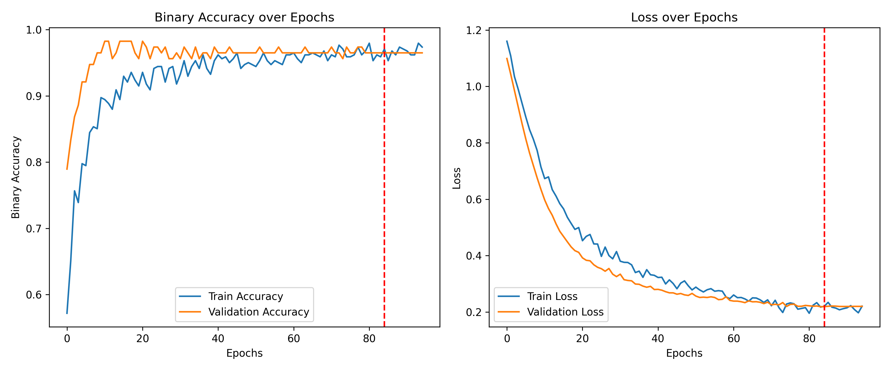

# Breast Cancer Detection with Artificial Neural Networks (ANN)

## Overview
This project implements an Artificial Neural Network (ANN) to predict breast cancer malignancy using texture features extracted from digitized breast mass images. The model achieves high accuracy in classifying tumors as benign or malignant, supporting early diagnosis and clinical decision-making.

## Project Structure
```
breast-cancer-detection-ann/
├── data/                   # Dataset storage
│   └── breast_cancer_data.csv  # Original dataset (569 samples, 32 features)
├── notebooks/              # Jupyter notebooks
│   ├── breast_cancer_detection_EN.ipynb  # English version (commented in English)
│   └── breast_cancer_detection_FA.ipynb  # Persian version (commented in Persian)
├── plots/                  # Visualization outputs
│   ├── correlation_matrix.png       # Feature correlation heatmap
│   ├── feature_histograms.png       # Distribution of numerical features
│   ├── model_architecture.png       # Neural network diagram
│   ├── target_distribution.png      # Class balance visualization
│   └── training_curves.png          # Accuracy/loss during training
├── .gitignore             # Files to exclude from version control
├── README.md              # Project documentation (this file)
└── requirements.txt       # Python dependencies
```

## Dataset
- **Source**: Wisconsin Diagnostic Breast Cancer (WDBC)
- **Samples**: 569 (357 benign, 212 malignant)
- **Features**: 32 texture characteristics including:
  - Radius, texture, perimeter, area
  - Smoothness, compactness, concavity
  - Mean, standard error, and worst values

## Key Features
1. Comprehensive feature engineering:
   - Geometric shape ratios (area/perimeter)
   - Worst-mean differences
   - Relative standard error metrics
   - Composite features for correlated variables
2. Advanced ANN architecture with:
   - L2 regularization (λ=0.005)
   - Dropout layers (30% rate)
   - He Normal initialization

## Model Architecture
```python
Model: "sequential"
_________________________________________________________________
 Layer (type)                Output Shape              Param #   
=================================================================
 dense (Dense)               (None, 32)                1344      
                                                                 
 dropout (Dropout)           (None, 32)                0         
                                                                 
 dense_1 (Dense)             (None, 16)                528       
                                                                 
 dropout_1 (Dropout)         (None, 16)                0         
                                                                 
 dense_2 (Dense)             (None, 1)                 17        
                                                                 
=================================================================
Total params: 1,889
Trainable params: 1,889
Non-trainable params: 0
```

## Training Performance

- Validation accuracy: 97.4%
- No overfitting observed

## Evaluation Results
### Training Set:
- Loss: 0.1739
- Binary Accuracy: 97.65%
- Precision: 99.60%
- Recall: 93.94%

### Validation Set:
- Loss: 0.2082
- Binary Accuracy: 97.37%
- Precision: 98.49%
- Recall: 93.73%

### Test Set:
- Loss: 0.1759
- Binary Accuracy: 98.25%
- Precision: 96.14%
- Recall: 96.14%

### Sample Predictions:
| Predicted Probabilities | True Values |
|-------------------------|-------------|
| 0.00495                 | 0 (Benign)  |
| 0.99622                 | 1 (Malignant)|
| 0.02376                 | 0 (Benign)  |
| 0.59797                 | 1 (Malignant)|
| 0.71741                 | 0 (Benign)  |

## How to Run
1. Clone repository:
```bash
git clone https://github.com/yourusername/breast-cancer-detection-ann.git
cd breast-cancer-detection-ann
```

2. Install dependencies:
```bash
pip install -r requirements.txt
```

3. Run Jupyter notebook:
```bash
jupyter notebook notebooks/breast_cancer_detection_EN.ipynb
```

## Dependencies
- Python 3.9+
- TensorFlow 2.10
- Scikit-learn 1.2
- Pandas 1.5
- Matplotlib 3.6
- Seaborn 0.12

## Clinical Significance
The developed model demonstrates strong potential for:
- Early detection of malignant tumors
- Reducing false negatives in screening
- Supporting radiologists in diagnostic workflows
- Providing second-opinion validation

---
## License
This project is licensed under the [MIT](LICENSE) License.

---

👋 We hope you find this project useful! 🚀

## Contact Developer  
    Email: masudpythongit@gmail.com 
    Telegram: https://t.me/Masoud_Ghasemi_sorna_fast
🔗 GitHub Profile: [sorna-fast](https://github.com/sorna-fast)
# تشخیص سرطان پستان با شبکه‌های عصبی مصنوعی (ANN)

## مرور کلی
این پروژه یک شبکه عصبی مصنوعی (ANN) برای پیش‌بینی بدخیمی سرطان پستان با استفاده از ویژگی‌های بافتی استخراج‌شده از تصاویر دیجیتالی توده‌های پستانی پیاده‌سازی می‌کند. مدل به دقت بالایی در طبقه‌بندی تومورها به خوش‌خیم و بدخیم دست یافته و از تشخیص زودهنگام و تصمیم‌گیری بالینی پشتیبانی می‌کند.

## ساختار پروژه
```
├── data/                   # ذخیره‌سازی مجموعه داده
│   └── breast_cancer_data.csv  # دیتاست اصلی (569 نمونه، 32 ویژگی)
├── notebooks/              # فایل‌های Jupyter
│   ├── breast_cancer_detection_EN.ipynb  # نسخه انگلیسی (کامنت انگلیسی)
│   └── breast_cancer_detection_FA.ipynb  #  نسخه فارسی (کامنت فارسی)
├── plots/                  # خروجی‌های مصورسازی
│   ├── correlation_matrix.png       # نمودار حرارتی همبستگی ویژگی‌ها
│   ├── feature_histograms.png       #  توزیع ویژگی‌های عددی
│   ├── model_architecture.png       #  دیاگرام شبکه عصبی
│   ├── target_distribution.png      # مصورسازی توازن کلاس‌ها
│   └── training_curves.png          # دقت/زیان در طول آموزش
├── .gitignore             # فایل‌های حذف شده از کنترل نسخه
├── README.md              # مستندات پروژه (همین فایل)
└── requirements.txt       # وابستگی‌های پایتون
```
## معماری مدل
```python
Model: "sequential"
_________________________________________________________________
 Layer (type)                Output Shape              Param #   
=================================================================
 dense (Dense)               (None, 32)                1344      
                                                                 
 dropout (Dropout)           (None, 32)                0         
                                                                 
 dense_1 (Dense)             (None, 16)                528       
                                                                 
 dropout_1 (Dropout)         (None, 16)                0         
                                                                 
 dense_2 (Dense)             (None, 1)                 17        
                                                                 
=================================================================
Total params: 1,889
Trainable params: 1,889
Non-trainable params: 0
```
## عملکرد آموزش

- دقت اعتبارسنجی: 97.4%
- عدم مشاهده بیش‌برازش

## مجموعه داده
- **منبع**: Wisconsin Diagnostic Breast Cancer (WDBC)
- **نمونه‌ها**: 569 (357 خوش‌خیم، 212 بدخیم)
- **ویژگی‌ها**: 32 مشخصه بافتی شامل:
  - شعاع، بافت، محیط، مساحت
  - همواری، فشردگی، فرورفتگی
  - مقادیر میانگین، خطای استاندارد و بدترین حالت

## نتایج ارزیابی
### مجموعه آموزش:
- تابع زیان: 0.1739
- دقت: 97.65%
- دقت تشخیص: 99.60%
- بازیابی: 93.94%

### مجموعه اعتبارسنجی:
- تابع زیان: 0.2082
- دقت: 97.37%
- دقت تشخیص: 98.49%
- بازیابی: 93.73%

### مجموعه آزمون:
- تابع زیان: 0.1759
- دقت: 98.25%
- دقت تشخیص: 96.14%
- بازیابی: 96.14%

### نمونه پیش‌بینی‌ها:
| احتمالات پیش‌بینی شده | مقادیر واقعی |
|----------------------|--------------|
| 0.00495              | 0 (خوش‌خیم)  |
| 0.99622              | 1 (بدخیم)    |
| 0.02376              | 0 (خوش‌خیم)  |
| 0.59797              | 1 (بدخیم)    |
| 0.71741              | 0 (خوش‌خیم)  |

## نحوه اجرا
1. کلون‌کردن مخزن:
```bash
git clone https://github.com/yourusername/breast-cancer-detection-ann.git
cd breast-cancer-detection-ann
```

2. نصب وابستگی‌ها:
```bash
pip install -r requirements.txt
```

3. اجرای نوت‌بوک:
```bash
jupyter notebook notebooks/breast_cancer_detection_FA.ipynb
```

## اهمیت بالینی
مدل توسعه‌یافته پتانسیل بالایی برای موارد زیر نشان می‌دهد:
- تشخیص زودهنگام تومورهای بدخیم
- کاهش منفی‌های کاذب در غربالگری
- پشتیبانی از رادیولوژیست‌ها در گردش‌کار تشخیصی
- ارائه اعتبارسنجی به عنوان نظر دوم
## مجوز
این پروژه تحت مجوز [MIT](LICENSE) منتشر شده است.


---
👋 امیدواریم این پروژه برای شما مفید باشد! 🚀

## ارتباط با توسعه‌دهنده  
    ایمیل: masudpythongit@gmail.com 
    تلگرام: https://t.me/Masoud_Ghasemi_sorna_fast
🔗 حساب گیتهاب: [sorna-fast](https://github.com/sorna-fast)

---


---

